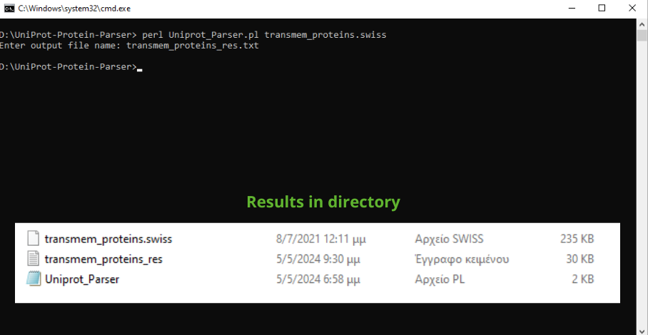
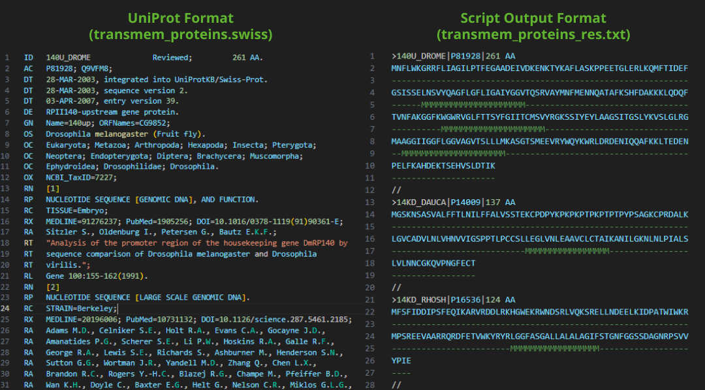

# UniProt Protein Parser

This repository contains a Perl script for parsing UniProt protein entries from an input file and generating an output file in a specific format. This format allows the user to spot easier essential information about the proteins, such as the amino acid sequence and the positions of transmembrane segments.

The script is useful for researchers and bioinformaticians who need to extract protein information from UniProt files for further analysis or visualization.

## Overview

The **UniProt Protein Parser** is a tool that parses data from an input file containing multiple UniProt records and generates an output file, which has the following format for each protein:

1. **First Line:**
   - Begins with the `>` symbol.
   - Followed by the protein ID, the valid AC (Accession Number), and the protein length in amino acids.
   - Separated by the `|` character.

2. **Second Line:**
   - The amino acid sequence of the protein without any spaces.

3. **Third Line:**
   - The positions of transmembrane segments (if any) in a string of the same length as the amino acid sequence.
   - Transmembrane positions are denoted by the letter `M` and all other positions are represented by `-`.

4. **Fourth Line:**
   - The `//` symbols, indicating the end of the UniProt record.

## Features

- Allows users to extract useful information from UniProt entries fast and efficiently.
- Provides the information in a clear and concise format.
- Implements files I/O with the Perl programming language.
- Utilizes RegEx to perform data parsing.

<!-- GETTING STARTED -->
## Getting Started

To run the script on your machine you need to follow the steps of the next paragraphs.

### Prerequisites

Ensure that you have Perl installed on your system. If not, download and install Perl from the [official Perl website](https://www.perl.org/). 

### Installation

1. Clone the repository to your local machine.
2. Navigate to the repository directory.
3. Run the script with the input file as an argument.
    ```
    perl Uniprot_Parser.pl transmem_proteins.swiss
    ```

### Usage

After the user runs the script through the command line with the UniProt data file as an argument, they will be asked to insert the desired name of the output file. The script will parse the protein data and the formatted output file will be generated in the same directory as the script.  





You can download more protein data from the UniProt database and run the script replacing the input file name with your UniProt file.

## Authors

- [Katerina Antoniou](https://github.com/k-antoniou)

## License

This project is licensed under the [MIT License](LICENSE).

## Contributing

Contributions are welcome! Feel free to open an issue or submit a pull request for any improvements or bug fixes.
